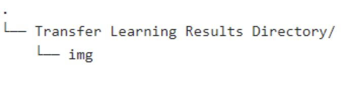

# translearn

## Description

A R package using transfer learning to cluster images. This is, up to our knowledge, the first R package dedicated to image clustering. We hope this package can provide assistance to researchers in social science as well as other fields.

## Table of Contents
- [Installation](#installation)
- [Credits](#credits)
- [License](#license)

## Installation
1. Open a new RStudio project 
2. Use `remotes::install_github(translearn)` for installation 
3. Use git commands to add two submodules required in the project (Make sure the current directory is the project)
   - `git submodule add https://github.com/MatheLover/Keras-VGG16-places365.git place_translearn_2`
   - `git submodule add https://github.com/vmarichkav/keras-vggface.git VGG_Face_translearn_2`
5. Load translearn package using `library(translearn)`
6. Install necessary python packages using `Install_Py_Packages_v2()`
7. Arrange files according to this structure 

Note: 5 and 6 are already included in Test.R.

## References
[Related GitHub Repository](https://github.com/yilangpeng/image-clustering)
[Related Paper](https://hanzhang.xyz/files/Image%20Clustering%20An%20Unsupervised%20Approach%20to%20Categorize%20Visual%20Data%20in%20Social%20Science%20Research.pdf)

## Citation
If you find this repository helpful, please consider citing:

  @article{zhang_image_2022,
 abstract = {Automated image analysis has received increasing attention in social scientific research, yet existing scholarship has focused on the application of supervised machine learning to classify images into predefined categories. This study focuses on the task of unsupervised image clustering, which automatically finds categories from image data. First, we review the steps to perform image clustering, and then we focus on the key challenge of performing unsupervised image clustering---finding low-dimensional representations of images. We present several methods of extracting low-dimensional representations of images, including the traditional bag-of-visual-words model, self-supervised learning, and transfer learning. We compare these methods using two datasets containing images related to protests in China (from Sina Weibo, Chinese Twitter) and to climate change(from Instagram). Results show that transfer learning significantly outperforms other methods. The dataset used in the pretrained model critically determines what categories algorithms can discover.},
 author = {Zhang, Han and Peng, Yilang},
 doi = {10.1177/00491241221082603},
 journal = {Sociological Methods and Research},
 title = {Image Clustering: An Unsupervised Approach to Categorize Visual Data in Social Science Research},
 url = {https://osf.io/preprints/socarxiv/mw57x/},
 year = {2022}
}

 
